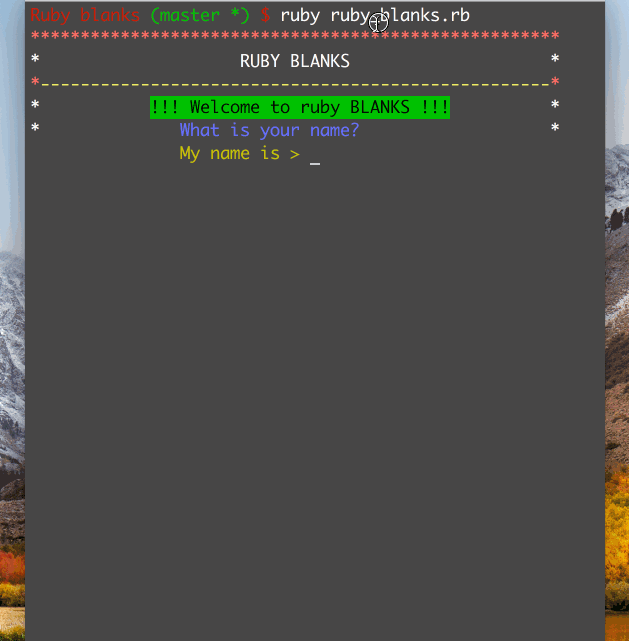

## About the project
Simple word guessing game that takes few word input from user and gives back a rhyme.

## Setup on local machine!
-``git clone git@github.com:ismatfarjana/Ruby-Blanks.git``
-``cd ruby_blanks``
-``run bundle install``

## How to use
Enter the specific type of word.

## Demo

